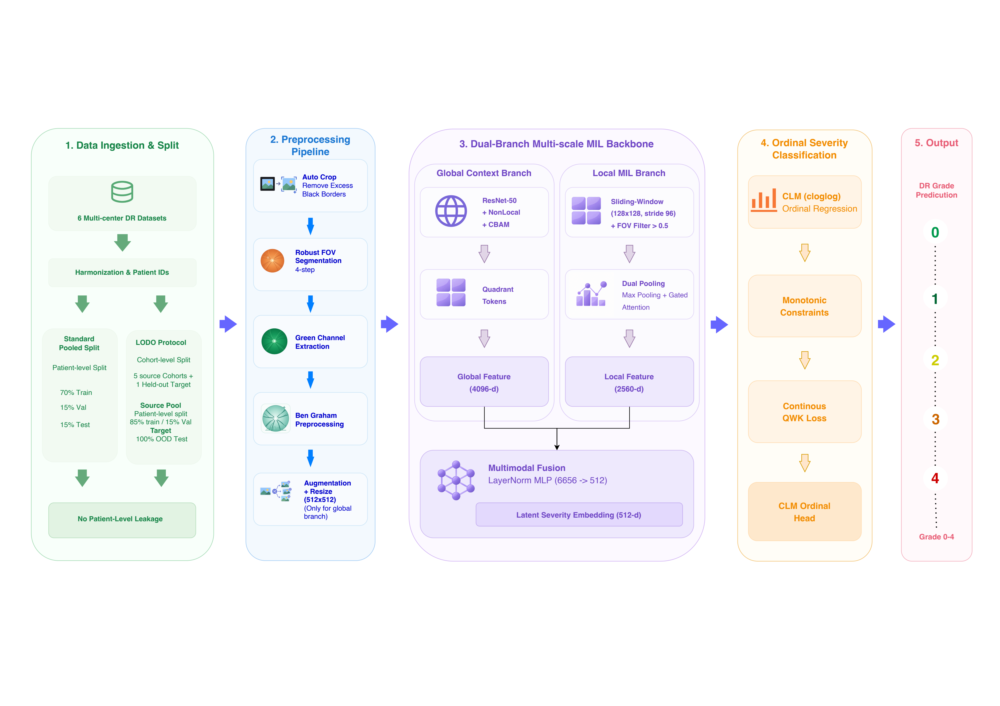

# DRDG: Dual-Branch Multi-Instance Learning with Cumulative Link Models for Cross-Cohort Domain Generalization in Diabetic Retinopathy

[](https://www.python.org/downloads/)
[](https://pytorch.org/)
[](https://opensource.org/licenses/MIT)

Official PyTorch implementation of **DRDG**, a dual-stream architecture engineered for robust out-of-distribution (OOD) generalization across multi-center retinal fundus photography cohorts without target domain adaptation or retraining.

---

## 🏛️ Proposed Framework Architecture

The end-to-end framework reflects the exact mathematical, architectural, and data-flow specifications implemented in [`notebooks/03_main_model.ipynb`](notebooks/03_main_model.ipynb), [`notebooks/04_head_ablation.ipynb`](notebooks/04_head_ablation.ipynb), and [`notebooks/05_component_analysis_lodo.ipynb`](notebooks/05_component_analysis_lodo.ipynb).

> 📄 **High-Resolution Vector Document**: [Download Proposed Framework Architecture (PDF)](documents/proposed-framework.pdf)



---

## 🔬 Five-Stage End-to-End Methodology

The framework decomposes the complex cross-center Diabetic Retinopathy grading challenge into five modular, reproducible stages:

### 1. Data Ingestion & Partitioning
- **6 Multi-Center Cohorts**: APTOS 2019, DDR, DeepDRiD, IDRiD, Messidor-2, and EyePACS ($N = 55{,}570$ images across $35{,}474$ patients).
- **Harmonization & Patient Isolation**: Robust patient extraction regexes eliminate cross-view and bilateral data leakage ($\text{Patients}(\text{Train}) \cap \text{Patients}(\text{Val}) = \emptyset$).
- **Partitioning Protocols**:
  - **Standard Pooled Split**: 70% Train, 15% Validation, 15% Test.
  - **Leave-One-Dataset-Out (LODO) Protocol**: 5 source cohorts (85% train / 15% validation with quota balancing) and 1 held-out cohort (100% OOD test), producing exactly 18 patient-isolated CSV files (`fold_{0-5}_{cohort}_{train|val|test}.csv`).

### 2. Multi-Scale Preprocessing Pipeline
- **Auto-Crop**: Removes redundant uninformative black borders surrounding the circular retina.
- **Robust 4-Step FOV Segmentation**: Otsu-based aperture mask segmentation isolating the retinal disk.
- **Green-Channel Extraction**: Isolates the green spectral band (~540–577 nm), where hemoglobin maximally absorbs light, suppressing choroidal background noise.
- **Ben Graham / CLAHE Preprocessing**: Standardizes local retinal contrast and color variations across disparate camera sensors.
- **Dual-Branch Feeding**:
  - **Global Branch**: Resized to $512 \times 512$ with spatial and photometric data augmentations.
  - **Local Branch**: High-resolution patches extracted at native scale from valid fundus regions (FOV ratio $\ge 0.5$).

### 3. Dual-Branch Multi-Scale MIL Backbone
- **Global Context Branch** (`ResNet-50` + `NonLocal` + `CBAM` + `Quadrant Tokens`):
  - Truncated at `layer4` ($2048 \times 16 \times 16$).
  - $1 \times 1$ Conv channel projection ($2048 \rightarrow 512$).
  - **CBAM**: Sequential channel and spatial attention modules.
  - **NonLocalBlock2D**: Bilateral vascular self-attention capturing hemispheric symmetry.
  - **Quadrant Tokens**: 4 anatomical quadrants ($8 \times 8$ each) pooling mean & max ($4 \times 512 = 2048$) concatenated with Global GAP ($512$) $\to$ **Global Feature: 4096-d**.
- **Local MIL Branch** (`EfficientNet-B0` + `Dual Pooling`):
  - Sliding-window patch extraction ($128 \times 128$, stride 96) filtered by FOV ratio $> 0.5$.
  - EfficientNet-B0 instance encoder projecting patches to $1280$-d embeddings.
  - **Dual Pooling**: Gated Attention Pooling (Ilse et al., 1280-d) + Top-$k$ Instance Max Pooling (1280-d) $\to$ **Local Feature: 2560-d**.
- **Multimodal Fusion**:
  - Concatenation: $\mathbf{f}_{\text{fused}} = [\mathbf{f}_{\text{global}} \,\|\, \mathbf{f}_{\text{local}}] \in \mathbb{R}^{B \times 6656}$.
  - LayerNorm MLP projection ($6656 \rightarrow 512$) with Mish activation and Dropout ($p=0.3$), preventing batch-size-1 instability $\to$ **Latent Severity Embedding: 512-d**.

### 4. Ordinal Severity Classification & Head Ablation
- **Champion Head**: Cumulative Link Model (CLM) with complementary log-log (`clog-log`) link function:
  $$F(u) = 1 - \exp(-\exp(u))$$
  - Latent linear severity score: $z = \mathbf{w}^T \mathbf{h}_{\text{latent}} \in \mathbb{R}$.
  - Parameterized strictly monotonic cutpoints via softplus: $b_0 = \theta_0, \; b_k = b_{k-1} + \text{softplus}(\Delta_k)$ guaranteeing $b_0 < b_1 < b_2 < b_3$.
- **Continuous QWK Hybrid Objective**:
  $$\mathcal{L}_{\text{total}} = \mathcal{L}_{\text{CLM}} + \lambda_{\text{qwk}} \mathcal{L}_{\text{QWK}}$$
  where $\lambda_{\text{qwk}} = 1.0$ and $\mathcal{L}_{\text{QWK}}$ continuously penalizes off-by-grade mistakes quadratically.
- **5-Head Controlled Ablation Suite**:
  1. `Softmax_CE`: Nominal categorical cross-entropy baseline.
  2. `Softmax_QWK`: Categorical Softmax with Continuous QWK loss.
  3. `CORAL`: Consistent Rank Logits with binary ordinal sub-tasks.
  4. `CORN`: Conditional Ordinal Regression Neural Network with conditional binary probabilities.
  5. `CLM_QWK`: Cumulative Link Model with clog-log link and Continuous QWK loss.

### 5. Output & Clinical Decision Support
- **Discrete Severity Staging**: ICDRS Grades 0 (No DR), 1 (Mild), 2 (Moderate), 3 (Severe), 4 (Proliferative DR).
- **Referable DR (RDR) Screening**: Post-hoc operating threshold $\tau^*$ calibrated strictly on source validation data at target specificity ($\ge 80\%$ or $\ge 95\%$), tested on held-out target cohorts with frozen threshold.
- **Explainable AI (XAI)**: Global Grad-CAM and Local MIL attention saliency projection objectively validated against expert lesion pixel ground truth from IDRiD (Pointing Game, Area-Matched Saliency Recall, Pixel AUROC).

---

## 📊 Model Variants Progression

| Variant | Global Branch | Local Branch | Output Head | Research Hypothesis |
| :--- | :--- | :--- | :--- | :--- |
| **V0** | ResNet-50 Baseline | None | Softmax CE | Nominal global CNN baseline |
| **V1** | ResNet-50 Global | EfficientNet-B0 + Gated Attention | Softmax CE | **H1**: Local MIL captures small focal lesions (microaneurysms) |
| **V2** | ResNet-50 + CBAM + NonLocal + Quadrants | EfficientNet-B0 + Gated Attention | Softmax CE | **H2**: Global structural attention captures vascular symmetry & optic disc |
| **V3** (Proposed) | ResNet-50 + CBAM + NonLocal + Quadrants | EfficientNet-B0 + Gated Attention | CLM + QWK Loss | **H3**: Ordinal CLM respects disease progression and penalizes severe errors |

---

## 📂 Repository Architecture & Package Structure

```
DR-ICCPR2026/
├── __init__.py               # Core package metadata and public symbol exports
├── config.py                 # Strongly-typed @dataclass configurations (zero YAML)
├── paths.py                  # Portable directory and path resolution utilities
├── STANDALONE_REPO_GUIDE.md  # Standalone extraction and self-contained notebook strategy
├── data/
│   ├── balancing.py          # Quota balancing (2,000 images per class pool)
│   ├── collate.py            # Variable-length patch batch collator
│   ├── datasets.py           # FundusDualBranchDataset with fast O(1) in-memory indexing
│   ├── fov.py                # Robust 4-step retinal FOV segmentation & aperture masks
│   ├── lodo.py               # 6-Fold LODO generator (18 CSVs) & zero-leakage verifier
│   ├── metadata.py           # MasterFundusRecord unified dataclass schema
│   ├── patches.py            # Sliding-window patch extraction (128x128, stride 96)
│   ├── patient_ids.py        # Patient ID extraction regexes & multi-view isolation
│   ├── preprocessing.py      # Circular ROI crop, Green Channel CLAHE & Ben Graham
│   ├── registry.py           # Cohort metadata registry and path resolution
│   ├── splits.py             # Patient-stratified split generator (GroupShuffleSplit)
│   ├── transforms.py         # Albumentations global photometric/spatial augmentations
│   ├── downloaders/          # Automated HTTP/Kaggle dataset downloaders
│   └── preparation/          # Per-cohort raw ingestion & standardization scripts
├── models/
│   ├── attention/            # CBAM, NonLocalBlock2D, and QuadrantTokenAggregator
│   ├── streams/              # GlobalContextStream (ResNet-50) & LocalMILBranch (EffNet-B0)
│   ├── heads/                # SoftmaxCE, SoftmaxQWK, CORAL, CORN, CLM
│   ├── variants/             # Model variant builders (V0, V1, V2, V3)
│   ├── fusion.py             # DualBranchFusion: LayerNorm MLP (6656 -> 512)
│   ├── full_model.py         # End-to-end multi-scale dual-branch model wrapper
│   └── factory.py            # Dynamic model factory builder
├── losses/
│   ├── qwk.py                # Continuous Quadratic Weighted Kappa loss
│   └── ordinal.py            # CORAL, CORN, and Ordinal NLL loss functions
├── training/
│   ├── trainer.py            # DRTrainer engine with mixed precision (AMP) & gradient clipping
│   ├── head_trainer.py       # DRHeadTrainer for controlled head ablation benchmarks
│   ├── optimization.py       # AdamW with two-tier LR parameter groups & Cosine Annealing
│   └── checkpoint.py         # PyTorch 2.6 safe checkpoint serialization & resume
├── evaluation/
│   ├── lodo.py               # Bipartite LODO fold evaluation (in_domain_val + ood_test)
│   ├── rdr.py                # Referable DR threshold calibration (tau*) & frozen evaluation
│   ├── result_schema.py      # Formal LODOFoldResult serialization schema (Zero fabrication)
│   ├── metrics.py            # QWK, Within-1 accuracy, per-grade sensitivity, accuracy
│   ├── grade_metrics.py      # Granular per-grade sensitivity and specificity calculations
│   ├── ordinal_metrics.py    # Mean Absolute Error (MAE), Off-by-2+ severe error rates
│   └── statistics.py         # Wilcoxon signed-rank tests with Bonferroni correction
├── explainability/
│   ├── gradcam.py            # Global branch Gradient-weighted Class Activation Mapping
│   ├── mil_saliency.py       # Local patch attention 2D spatial projection & smoothing
│   ├── idrid_dataset.py      # Composite binary mask loader (MA, HE, EX, SE)
│   └── metrics.py            # Quantitative Pointing Game, Area-Matched Recall, Pixel AUROC
├── experiments/
│   ├── lodo.py               # 6-Fold LODO cross-domain benchmark orchestration
│   ├── head_ablation.py      # 5-Head controlled ablation benchmark runner
│   └── xai.py                # Quantitative XAI evaluation runner against IDRiD masks
├── utils/
│   ├── device.py             # Hardware device selection and automatic mixed precision
│   ├── io.py                 # File I/O helpers and serializations
│   ├── logging.py            # Formatted research logging utility
│   └── seed.py               # Multi-framework deterministic seed setter
├── visualization/
│   └── paper_figures.py      # Publication-quality vector figures (300 DPI) & LaTeX tables
├── notebooks/
│   ├── 01_merge_dataset_lodo.ipynb        # 6-Fold LODO dataset harmonization & CSV generation
│   ├── 02_merge-dataset.ipynb             # Multi-center dataset merging & pooled splitting
│   ├── 03_main_model.ipynb                # Champion V3 Dual-Branch training & validation
│   ├── 04_head_ablation.ipynb             # 5-Head controlled ablation study & calibration
│   └── 05_component_analysis_lodo.ipynb   # Component analysis & cross-domain LODO benchmark
└── documents/
    ├── proposed-framework.pdf# High-resolution architectural framework diagram (PDF)
    └── proposed-framework.png# High-resolution architectural framework diagram (PNG)
```

---

## 🔬 Multi-Center Clinical Benchmark (6 Cohorts)

| Cohort | Country | Device / FOV | Images (Patients) | Grade Distribution (%) [$G_0$ / $G_1$ / $G_2$ / $G_3$ / $G_4$] | Grading Protocol |
| :--- | :--- | :--- | :--- | :--- | :--- |
| **APTOS 2019** | India | Zeiss, Topcon ($45^\circ$) | 3,662 (3,662) | 49.3 / 10.1 / 27.3 / 5.3 / 8.1 | Single-grader ICDR |
| **DDR** | China | Canon CR-2, Topcon ($45^\circ$) | 12,522 (12,522) | 50.0 / 5.0 / 35.8 / 1.9 / 7.3 | Multi-expert consensus |
| **DeepDRiD** | China | Topcon TRC-NW400 ($45^\circ$) | 2,000 (500) | 34.0 / 17.8 / 19.6 / 19.6 / 9.0 | 2-field paired stereoscopic |
| **IDRiD** | India | Kowa VX-10$\alpha$ ($50^\circ$) | 516 (516) | 32.6 / 4.8 / 32.6 / 18.0 / 12.0 | Multi-expert + lesion masks |
| **Messidor-2** | France | Topcon TRC NW6 ($45^\circ$) | 1,744 (711) | 58.3 / 15.5 / 19.9 / 4.3 / 2.0 | Multi-grader consensus |
| **EyePACS** | USA | Centervue, Canon ($45^\circ$) | 35,126 (17,563) | 73.5 / 7.0 / 15.1 / 2.5 / 2.0 | Real-world tele-screening |
| **Total / Harmonized** | Multi | Diverse Multi-Vendor ($45^\circ$--$50^\circ$) | **55,570 (35,474)** | **64.3 / 7.4 / 21.0 / 3.4 / 3.9** | **Harmonized ICDR 5-grade scale** |

---

## 🚀 Execution & Reproduction Guide

### 1. Installation

```bash
git clone https://github.com/baohuy2209/DR-ICCPR2026.git
cd DR-ICCPR2026
pip install -e .
```

### 2. Dual-Layer Execution Protocol

- **Interactive Self-Contained Research Notebooks**: All reference Jupyter notebooks in [`notebooks/`](notebooks/) are completely self-contained with full data pipelines, training loops, and validation metrics implemented in code cells, allowing instant execution on Google Colab or Kaggle:
  - [`notebooks/01_merge_dataset_lodo.ipynb`](notebooks/01_merge_dataset_lodo.ipynb): Harmonizes 6 multi-center cohorts and generates 18 patient-isolated LODO split CSV files.
  - [`notebooks/02_merge-dataset.ipynb`](notebooks/02_merge-dataset.ipynb): Aggregates multi-center cohorts for standard pooled 70/15/15 cross-validation.
  - [`notebooks/03_main_model.ipynb`](notebooks/03_main_model.ipynb): Trains the full Champion V3 Dual-Branch architecture (ResNet-50 + EffNet-B0 MIL + CLM QWK).
  - [`notebooks/04_head_ablation.ipynb`](notebooks/04_head_ablation.ipynb): Executes the 5-head controlled ablation study and generates screening calibration curves.
  - [`notebooks/05_component_analysis_lodo.ipynb`](notebooks/05_component_analysis_lodo.ipynb): Runs full component analysis and 6-Fold cross-domain LODO benchmark evaluation.

- **Modular Python Experiment Runners**: For batch training, cluster execution, and automated evaluation, use the dedicated runners in [`experiments/`](experiments/):

```python
# 1. Running 6-Fold LODO Cross-Domain Benchmark
from experiments.lodo import LODOExperimentRunner

runner = LODOExperimentRunner(variant="v3", dry_run=False, device="cuda")
results = runner.run()

# 2. Running 5-Head Controlled Ablation Suite
from experiments.head_ablation import HeadAblationRunner

ablation = HeadAblationRunner(all_heads=True, device="cuda")
ablation_results = ablation.run()

# 3. Quantitative XAI Evaluation against IDRiD Pixel Ground Truth
from experiments.xai import QuantitativeXAIRunner

xai = QuantitativeXAIRunner(
    variant="v3",
    checkpoint_path="checkpoints/v3_best.pt",
    device="cuda"
)
xai_results = xai.run()
```

---

## 📜 Documentation & Core Module Traceability

The core mathematical, architectural, and evaluation methodologies are directly traceable to the modular components:

- **Standalone Extraction Guide**: [`STANDALONE_REPO_GUIDE.md`](STANDALONE_REPO_GUIDE.md) documents repository extraction, replication philosophy, and notebook self-containment.
- **System Architecture & PDF**: [`documents/proposed-framework.pdf`](documents/proposed-framework.pdf) provides the complete vector-grade architectural schematic.
- **Cumulative Link Models & Continuous QWK**: Implemented in [`models/heads/clm.py`](models/heads/clm.py) and [`losses/qwk.py`](losses/qwk.py) with strictly monotonic cutpoints.
- **Dual-Branch Backbone & Fusion**: Implemented in [`models/streams/`](models/streams/), [`models/attention/`](models/attention/), and [`models/fusion.py`](models/fusion.py).
- **Patient Isolation & LODO Protocol**: Guaranteed in [`data/patient_ids.py`](data/patient_ids.py) and [`data/lodo.py`](data/lodo.py) with zero train/val patient leakage.
- **Formal Evaluation Schema**: Serialized via [`evaluation/result_schema.py`](evaluation/result_schema.py) enforcing reproducible metric logging.
